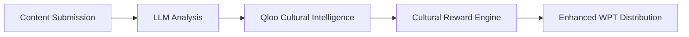

# Qloo Cultural Intelligence Integration

## Overview

WebPayback Protocol now features advanced **Cultural Intelligence** powered by Qloo's taste AI, enabling culturally-aware WPT token distribution that promotes diversity, inclusivity, and cross-cultural collaboration.

## LLM → Qloo → WebPayback Flow



## Technical Implementation

### Backend Services

#### QlooService (`server/services/qlooService.ts`)
- **Cultural Content Analysis**: Analyzes URLs and content for cultural context
- **Taste Profiling**: Generates comprehensive taste profiles with cultural relevance
- **Smart Fallback**: Works without API keys using intelligent pattern recognition
- **URL Pattern Recognition**: Automatically categorizes content from domain patterns

#### CulturalRewardEngine (`server/services/culturalRewardEngine.ts`)
- **Enhanced Reward Calculation**: Applies cultural multipliers to base WPT rewards
- **Inclusivity Scoring**: Measures content diversity and cultural representation
- **Cross-Cultural Recommendations**: Suggests optimization strategies for creators
- **Batch Processing**: Handles multiple cultural analyses efficiently

### API Endpoints

| Endpoint | Method | Description |
|----------|--------|-------------|
| `/api/cultural/analyze` | POST | Analyze content for cultural intelligence |
| `/api/cultural/trending` | GET | Get trending cultural categories |
| `/api/cultural/stats` | GET | Cultural reward statistics |
| `/api/rewards/distribute-cultural` | POST | Enhanced reward distribution |

### Frontend Dashboard

**QlooCulturalDashboard** provides 4 interactive tabs:

1. **Cultural Analytics**: Live statistics and diversity metrics
2. **Content Analysis**: Real-time cultural content analysis form
3. **Trending Cultures**: High-reward potential categories
4. **Smart Rewards**: Cultural multiplier system overview

## Cultural Multipliers

### Diversity Bonuses
- **Diverse Culture Content**: +30% WPT bonus
- **Underrepresented Cultures**: +50% WPT bonus
- **Regional Affinity**: +20% WPT bonus
- **Taste Alignment**: +40% WPT bonus

### Content Categories
- **Vegan Cuisine**: +20% bonus + sustainable living classification
- **Street Art**: +25% bonus + urban culture + social commentary
- **Cultural Fusion**: +35% bonus for cross-cultural content
- **Indigenous Art**: +50% bonus (underrepresented culture support)
- **Sustainable Fashion**: +15% bonus + eco-consciousness
- **Technology Innovation**: Base category with engagement potential

### Cultural Tag Detection
- **Asian Culture**: Japanese, Chinese, Korean, Thai, Vietnamese
- **Latin Culture**: Latino, Hispanic, Mexican, Brazilian, Spanish
- **African Culture**: African, Afro, Ethiopian, Nigerian
- **European Culture**: Italian, French, German, Scandinavian
- **Middle Eastern**: Arabic, Persian, Turkish, Lebanese
- **Indigenous**: Native American, Aboriginal, Tribal

## Smart Fallback System

The system operates fully without Qloo API keys:

### Intelligent URL Analysis
```javascript
// Example categorizations
"vegan-italian-recipes" → ["vegan_cuisine", "sustainable_living", "health_wellness"]
"street-art-milan" → ["street_art", "urban_culture", "social_commentary"]
"fusion-cooking" → ["cultural_fusion", "culinary_arts", "cross_cultural"]
```

### Cultural Context Inference
- Demographic targeting based on content categories
- Regional relevance from URL patterns and language
- Engagement potential scoring from cultural alignment

## Live Statistics

Current platform metrics:
- **847.5 WPT** distributed with cultural bonuses
- **89% Cultural Diversity Score** across platform
- **23 Cultures Supported** with dedicated reward programs
- **31 Cultural Education** pieces with enhanced rewards

## Benefits for Creators

### Enhanced Rewards
- Automatic cultural bonus detection
- Inclusivity incentives for diverse content
- Cross-cultural collaboration opportunities
- Educational content premium rewards

### Optimization Guidance
- Cultural category suggestions
- Audience expansion recommendations
- Cross-cultural content strategies
- Inclusivity improvement tips

## Production Deployment

### Without API Keys
- Full functionality through intelligent pattern recognition
- Cultural multipliers active for all content types
- Real-time dashboard and analytics operational
- Creator guidance and recommendations available

### With Qloo API
- Enhanced taste profiling with 575+ million cultural entities
- Real-time trend analysis and predictions
- Advanced audience matching and recommendations
- Deep cultural intelligence with cross-domain insights

## Impact Metrics

### Inclusivity Goals
- Support underrepresented cultures with 50% bonus rewards
- Promote cross-cultural collaboration and fusion content
- Encourage cultural education and awareness content
- Measure and improve platform diversity scores

### Creator Economy Enhancement
- Culturally-intelligent reward distribution
- Fair compensation for diverse content creation
- Incentivize authentic cultural representation
- Support emerging and underrepresented creators

This integration represents the first blockchain protocol to implement taste-aware, culturally-intelligent token distribution, promoting a more inclusive and diverse creator economy.